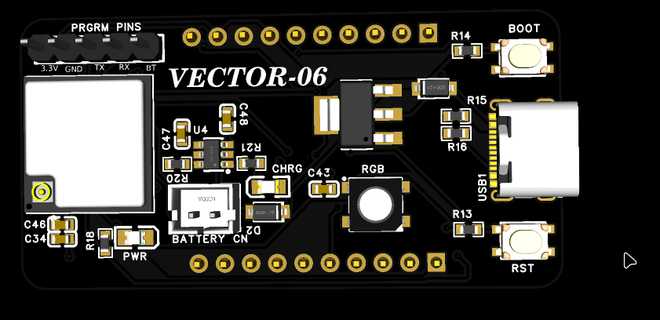
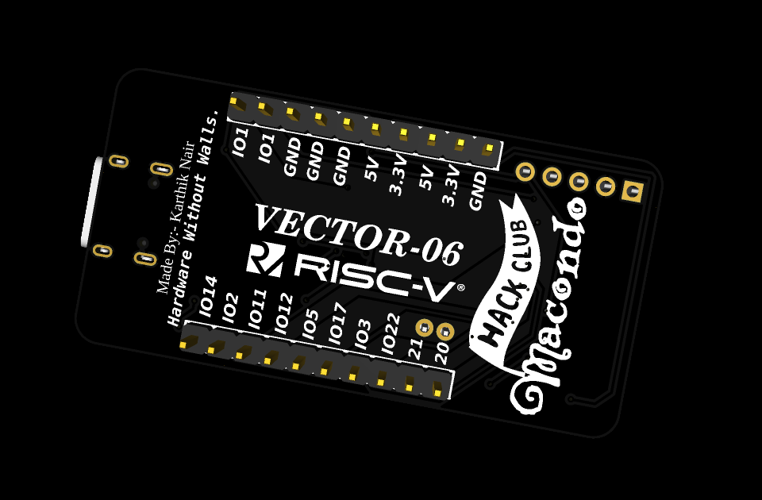
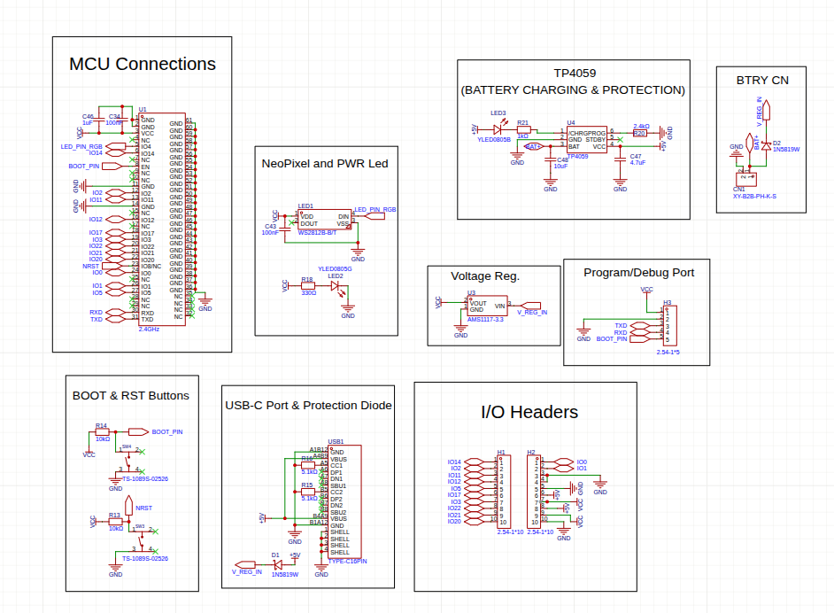
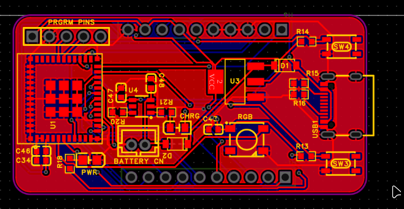
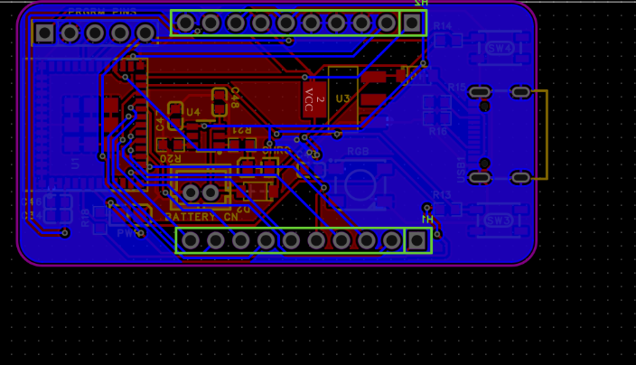

# VECTOR-06
# High-Efficiency RISC-V Wireless Development Board

An ultra-compact wireless development board powered by an Ai-Thinker Ai-WB2-M1-I module with a Bouffalo Lab BL602 RISC-V SoC. It features an dedicated LiPo battery charging system with connector and an onboard WS2812B NeoPixel.
EasyEDA Project Post and viewing link:-https://oshwlab.com/karthiknair121232/project_agshyvwx

## Pictures

| Top View | Bottom View |
| :---: | :---: |
|  |  |

## Features

* Core MCU: Bouffalo Lab BL602 32-bit RISC-V processor running up to 160MHz with 276KB RAM.
* Wireless Protocols: Dual-mode Wi-Fi (IEEE 802.11 b/g/n up to 72.2 Mbps) and Bluetooth 5.0 Low Energy (BLE) / BLE Mesh.
* Smart Power Architecture: Automatic hardware power-path switching between USB-C and LiPo Battery power.
* Integrated Charger: Dedicated onboard LiPo charging circuit powered by a high-efficiency TP4059 controller.
* Onboard NeoPixel: A single integrated WS2812B RGB Smart LED.

## Hardware Architecture & Design Details

### Circuit Schematic Highlights
* Dual-Source Power Path Switching: Implements a protective dual-diode Schottky configuration (V_REG_IN). When USB-C is plugged in, the system automatically sources power from the 5V VBUS line and disconnects the battery load, preventing dangerous back-feeding into your computer's USB port.
* Battery Management Engine: Integrates a TP4059 lithium charging network housed in a compact SOT-23-6 package. It features a dedicated amber charging status indicator LED and an optimized PROG resistor network to safely govern current thresholds.
* Power Regulation: An AMS1117-3.3V LDO regulator processes input voltage down to a stable system rail, stabilized by a massive 22µF reservoir capacitor at its output.
* Advanced Logic Compatibility: The WS2812B NeoPixel is powered directly from the clean 3.3V rail rather than 5V. This scales its internal data detection thresholds downward, allowing the 3.3V RISC-V GPIO signal to reliably trigger data packets without requiring a bulky hardware logic-level shifter.

| Circuit Schematic Design |
| :---: |
|  |

| PCB Top Layer Routing | PCB Bottom Layer Routing |
| :---: | :---: |
|  |  |

## Pinout Configuration

The VECTOR-06 breaks out its system pins and available General Purpose I/O (GPIO) lines into two standard 2.54mm 1x10 male headers (H1 and H2).

### Left side pin Headers
* Pin 1: IO14 
* Pin 2: IO2
* Pin 3: IO11
* Pin 4: IO12
* Pin 5: IO5
* Pin 6: IO17
* Pin 7: IO3
* Pin 8: IO22
* Pin 9: IO21
* Pin 10: IO20

### Right side Pin Headers
* Pin 1: IO0
* Pin 2: IO1
* Pin 3: GND
* Pin 4: GND
* Pin 5: GND
* Pin 6: 5v
* Pin 7: 3.3v
* Pin 8: 5V
* Pin 9: 3.3V
* Pin 10: GND 

### Some Things to keep in mind:
If you are writing firmware for the board, keep in mind these hardwired hardware assignments from the schematic:
* NeoPixel Pin: Wired to IO4 (LED_PIN_RGB).
* Boot Button: Wired to EN (BOOT_PIN), pulled high to VCC via a 10kΩ resistor (R14), and shorts to GND when pressed.
* Reset Button: Wired to NRST, pulled high to VCC via a 10kΩ resistor (R13), and shorts to GND when pressed.
* Program/Debug Header: Breaks out GND, TXD, RXD, BOOT_PIN, and VCC in a clean 5-pin row for external serial flashing.

## License

This hardware project is open-source and distributed under the Apache License 2.0. You are free to copy, modify, distribute, and commercially manufacture this hardware layout. This license provides built-in protection regarding contributor safety, trademark preservation, and implicit patent defense.

For the complete legal text, please check the accompanying LICENSE file.
